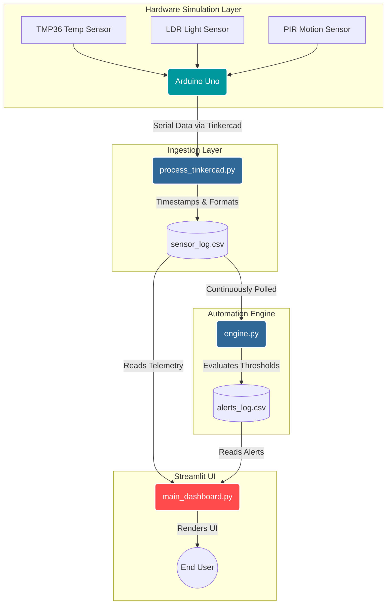
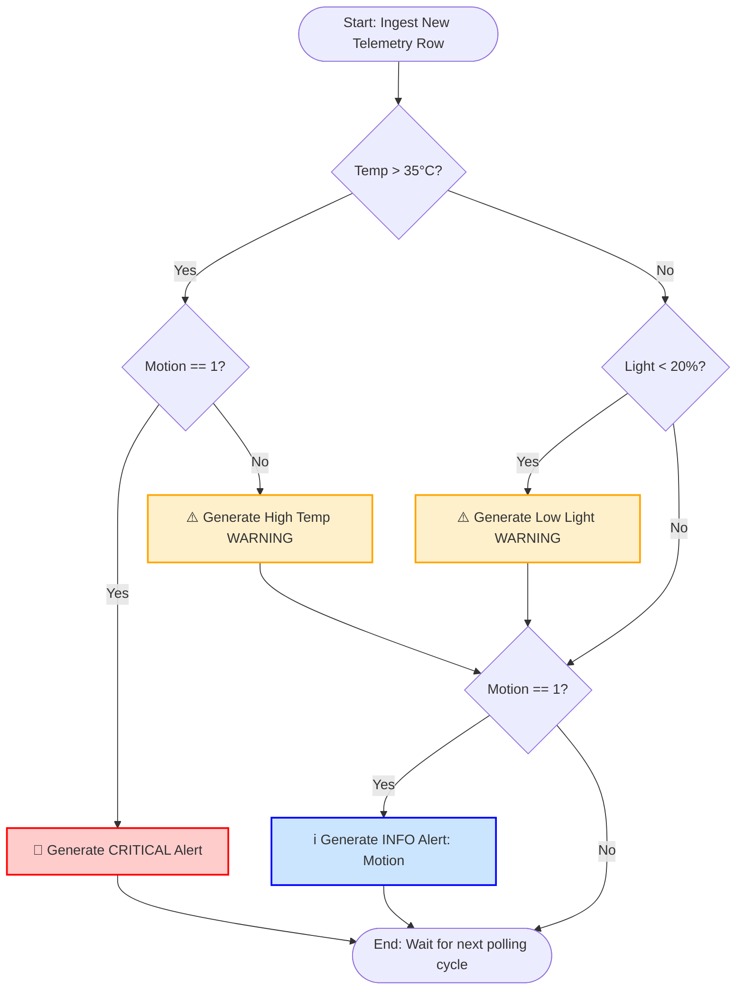
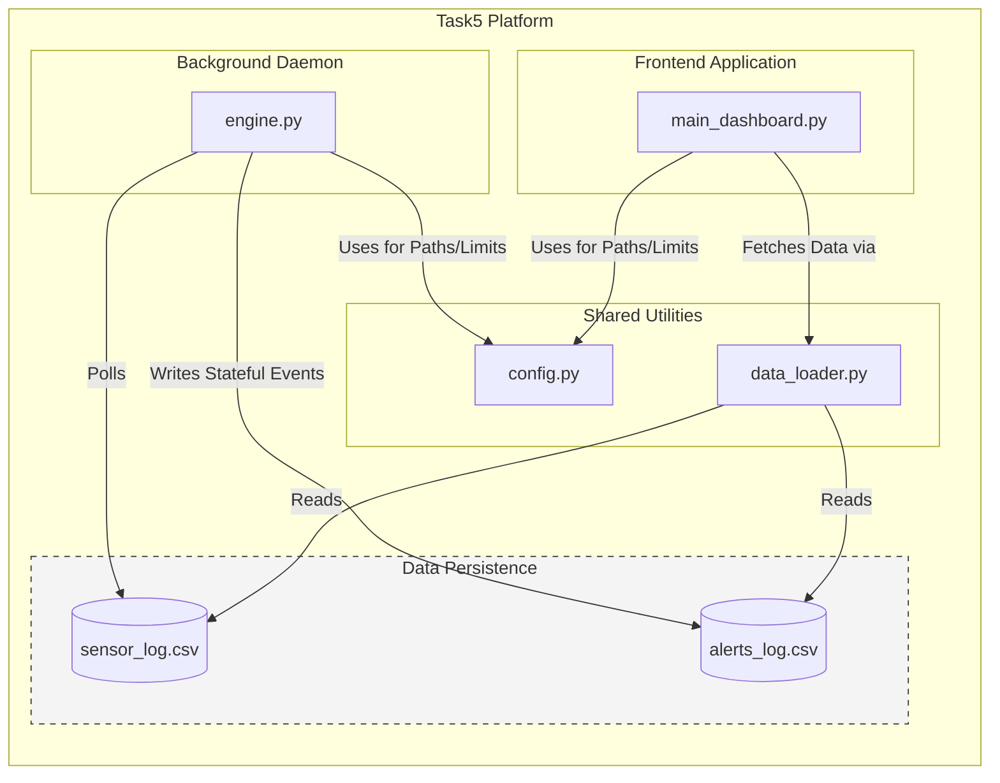

# 📄 Project Report: Smart Environment Monitoring & Alert System

**Project Type:** IoT Software Architecture & Data Pipeline Integration  
**Context:** DecodeLabs IoT Internship Deliverable  
**Author:** Ahana Banerjee  

---

## 1. Executive Summary
This report details the architectural design, development, and integration of a Smart Environment Monitoring and Alert System. The primary objective was to engineer a robust, decoupled software pipeline capable of ingesting simulated edge-device telemetry, executing autonomous business-logic rules, and rendering real-time data visualizations. 

By separating the data generation, logical processing, and presentation layers, the project successfully mimics an enterprise-grade, microservices-style IoT platform. The final deliverable is a fault-tolerant, locally deployable Streamlit web application supported by an asynchronous background alerting daemon.

---

## 2. System Architecture
The system departs from monolithic script designs in favor of a modular, asynchronous pipeline. This ensures that UI rendering processes do not block backend data evaluations.

### 2.1 High-Level Component Flow
The following diagram illustrates the end-to-end data pipeline, demonstrating the decoupled nature of the edge, logic, and presentation layers.

1. **Edge Node Simulation (Hardware Layer):** Generates analog/digital environmental signals.
2. **Ingestion Pipeline (Bridge Layer):** Serializes hardware outputs and appends localized system timestamps.
3. **Primary Datastore (Storage Layer):** A continuously updated, UTF-8 encoded flat file (`sensor_log.csv`).
4. **Automation Daemon (Logic Layer):** A headless worker polling the datastore to evaluate thresholds and commit stateful events to `alerts_log.csv`.
5. **Presentation Application (UI Layer):** A reactive frontend consuming both datastores via centralized, error-handled utility functions.

---

## 3. Technology Stack

* **Simulation Environment:** Autodesk Tinkercad
* **Microcontroller:** Arduino Uno (Simulated Firmware in C++)
* **Sensor Array:** * TMP36 (Analog Temperature)
* Photoresistor / LDR (Analog Ambient Light via Voltage Divider)
* PIR Sensor (Digital Motion Detection)

* **Backend Processing:** Python 3.8+, Pandas (Dataframe manipulation)
* **Frontend Framework:** Streamlit (Reactive UI), Plotly Express (Interactive visual graphing)
* **Data Persistence:** Standardized CSV (Comma-Separated Values)

---

## 4. Task-by-Task Implementation Details

### 4.1 Task 2: Sensor Data Simulation & Ingestion

**Objective:** Establish the foundational telemetry stream without relying on active hardware.

* **Hardware Simulation:** Designed a Tinkercad circuit mapping the TMP36 to `A0`, the LDR to `A1`, and the PIR to `D2`. The C++ firmware was written to avoid `delay()` blocking, utilizing `millis()` for a 5000ms sampling rate.
* **Pipeline Engineering:** Because browser-based simulators lack local file system access, a Python batch-processing script (`process_tinkercad.py`) was engineered. It parses the raw serial buffer, injects accurate `datetime` timestamps, and structures the payload into a strictly formatted schema: `Timestamp, Temperature, Light, Motion`.

### 4.2 Task 3: Real-Time Monitoring Dashboard

**Objective:** Develop the initial presentation layer for raw data observation.

* **Framework Integration:** Utilized Streamlit to build a stateless UI.
* **State Management & Caching:** Implemented `@st.cache_data(ttl=2)` decorators on Pandas read functions. This Time-To-Live configuration optimizes memory by preventing continuous disk reads while simulating a real-time WebSocket experience via a `time.sleep()` loop.
* **Visualization:** Integrated Plotly Express to render dynamic time-series line charts for Temperature and Ambient Light, offering superior interactivity (pan, zoom, hover) compared to native plotting libraries.

### 4.3 Task 4: Autonomous Automation Logic

**Objective:** Transition from a passive observation tool to an active alerting system.

* **Daemon Architecture:** Developed `engine.py`, a headless background worker script designed to run indefinitely in a separate terminal process.
* **Stateful Processing:** The engine reads `alerts_log.csv` on boot to determine the last processed timestamp, preventing duplicate alert generation upon system restarts.
* **Hierarchical Rule Engine:** * **Critical:** Temp > 35°C AND Motion Detected.
* **Warning:** Temp > 35°C OR Light < 20%.
* **Information:** Motion Detected.
* *Design Decision:* The logic prioritizes Critical events, suppressing lower-tier warnings for the same timestamp to prevent UI alert fatigue.

**Automation Engine Logic Tree:**

### 4.4 Task 5: Final System Integration

**Objective:** Refactor the codebase into a production-ready, deployable application.

* **Centralized Configuration:** Abstracted hardcoded paths and threshold integers into `utils/config.py`. This ensures environment-independent execution.
* **Shared Data Utilities:** Consolidated Pandas I/O operations into `utils/data_loader.py`. Implemented defensive programming techniques (`try/except` blocks, `df.empty` checks) to prevent `KeyError` and `EmptyDataError` crashes if the datastore files are cleared or temporarily locked.
* **UI Overhaul:** Rebuilt the dashboard utilizing `st.tabs` to logically separate Live Telemetry, Historical Analytics (daily averages, motion frequency distribution), and the Alert Management ledger.

**Microservices Component Map:**

---

## 5. Engineering Challenges & Resolutions

1. **File Encoding Conflicts (UnicodeDecodeError):**
* *Issue:* Windows default encoding (`cp1252`) corrupted the degree symbol (`°`) written by the background engine, causing Pandas to crash upon ingestion.
* *Resolution:* Enforced strict `encoding='utf-8'` parameters across all `open()` and `pd.read_csv()` functions globally, ensuring cross-platform data integrity.

2. **I/O Race Conditions:**
* *Issue:* The Streamlit UI attempted to read the `alerts_log.csv` at the exact millisecond the automation engine was creating it, resulting in missing column headers.
* *Resolution:* Implemented existence checks (`os.path.exists`) and header validation (`'Timestamp' in df.columns`) before attempting datetime conversions, gracefully failing over to empty dataframes instead of throwing fatal exceptions.

---

## 6. Future Extensibility Scope

The decoupled nature of this architecture allows for seamless future upgrades:

* **Cloud Database Migration:** The CSV data loader utility can be hot-swapped for a NoSQL driver (e.g., Firebase, MongoDB) without altering the UI or Engine logic.
* **External API Integration:** The `engine.py` can be extended to dispatch HTTP POST requests to Twilio or SendGrid for external SMS/Email notifications upon Critical alerts.
* **Containerization:** Wrapping the application in Docker containers would allow for instant deployment on AWS EC2 or Google Cloud Run.

---

## 7. Conclusion

This project successfully synthesized core concepts of IoT hardware simulation, Python software engineering, and data pipeline management. By adhering to professional architectural standards—such as modularity, fault tolerance, and separation of concerns—the final platform serves as a highly robust and scalable monitoring solution.
