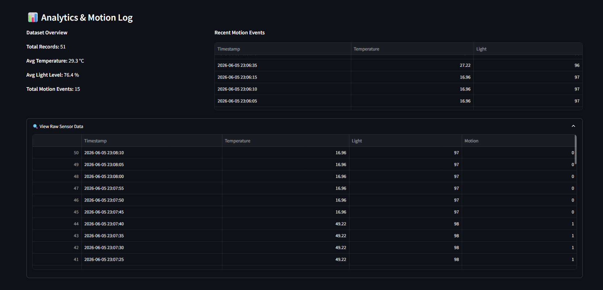

# Task 3: IoT Monitoring Dashboard

## 📌 Overview
This task implements a real-time, interactive dashboard using **Streamlit** to monitor the smart environment metrics generated in Task 2. The dashboard acts as the primary presentation layer, ingesting the standardized `sensor_log.csv` and visualizing the data stream dynamically.

## 🏗️ Architecture & Design
* **Frontend Framework:** Streamlit (chosen for rapid UI prototyping and Python native integration).
* **Data Visualization:** Plotly Express for highly interactive, production-quality line charts.
* **Data Ingestion:** Pandas, utilizing Streamlit's caching (`@st.cache_data`) with a short TTL for optimal read performance without locking the file system.
* **State Management:** Implemented a custom auto-refresh loop in the sidebar to simulate live socket connections without the overhead of a dedicated backend server.

## 📸 Dashboard Screenshots



## 🚀 How to Run Locally

1. Ensure Task 2 is running and actively writing to `sensor_log.csv`.
2. Navigate to the `dashboard` directory:
   ```bash
   cd dashboard
   ```
3. Install the required dependencies:
   ```bash
   pip install -r requirements.txt
   ```
4. Launch the application:
   ```bash
   streamlit run app.py
   ```
---

## ⏭️ Extensibility for Future Tasks

The UI container hierarchy has been explicitly designed to support drop-in expansions:

### Task 4 (Automation Logic): 
Blank UI containers are reserved below the header for future alert banners (e.g., "Temperature > Threshold").

### Task 5 (Mini Project Integration): 
The modular load_data() function can easily be swapped from local CSV reading to cloud database fetching when deployed.