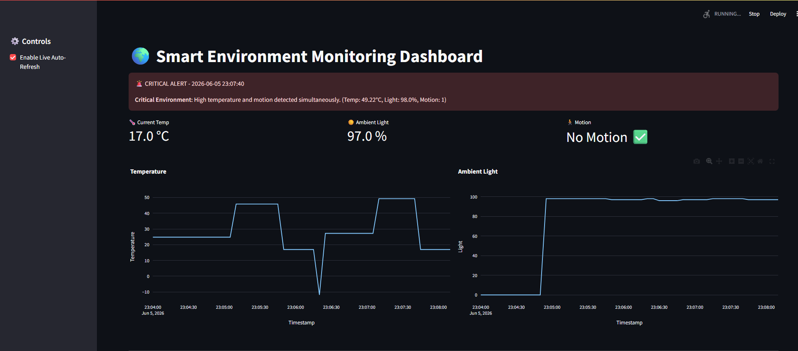
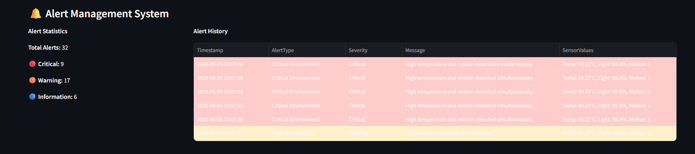

# 🚀 Task 4: IoT Automation & Alert Engine

## 📌 Project Overview
This task evolves the Smart Environment Monitoring system from a passive data viewer into an **active, intelligent alerting system**. 

By introducing a dedicated Automation Engine, the system now continuously evaluates raw telemetry data (Temperature, Light, and Motion) against predefined business rules. When thresholds are breached, the engine generates prioritized alerts, which are then rendered in real-time on the Streamlit dashboard.

## 🏗️ Architectural Design
To simulate a professional, enterprise-grade IoT stack, this task implements a **microservices-inspired architecture**:
1. **Sensor Pipeline (Task 2):** Ingests simulated edge device data into `sensor_log.csv`.
2. **Automation Daemon (`automation.py`):** A headless background worker that polls the datastore, evaluates logic, and maintains state via `alerts_log.csv`.
3. **Presentation Layer (`updated_app.py`):** A lightweight Streamlit frontend that exclusively handles UI/UX and data visualization, remaining completely decoupled from the business logic.

### 🛡️ Engineering Resilience 
* **Fault Tolerance:** The dashboard implements defensive programming (`try/except` blocks and empty-dataframe checks) to prevent system crashes during I/O interruptions or if data files are temporarily cleared.
* **Universal Encoding:** Explicit `UTF-8` pipeline enforcement ensures that special characters (like the `°` symbol in temperature readings) do not corrupt the data stream across different operating systems.

---

## 📂 Directory Structure
```text
Task4/
├── automation_engine/
│   ├── alert_rules.py        # Isolated business logic and threshold definitions
│   ├── automation.py         # Polling daemon and I/O handler
│   └── data/                 
│       └── alerts_log.csv    # Stateful alert storage (UTF-8 encoded)
├── dashboard_extension/
│   └── updated_app.py        # Streamlit dashboard with injected alert UI
└── README.md

```

---

## 📋 Automation Rules & Severity Mapping

The engine evaluates conditions hierarchically to prevent alert fatigue.

| Severity Level | Trigger Condition | Dashboard Action |
| --- | --- | --- |
| **🚨 CRITICAL** | Temp > 35°C **AND** Motion == 1 | Red UI Banner + Urgent Log |
| **⚠️ WARNING** | Temp > 35°C **OR** Light < 20% | Yellow UI Banner + Warning Log |
| **ℹ️ INFO** | Motion == 1 | Blue UI Banner + Info Log |

---

## 🚀 Setup & Execution Guide

### 1. Prerequisites

Ensure you have activated your project's virtual environment. If you haven't installed the dependencies yet:

```bash
pip install streamlit==1.36.0 pandas==2.2.2 plotly==5.22.0

```

### 2. Running the Full System

To see the decoupled architecture in action, you will run the system across three separate terminal windows.

**Terminal 1: Start the Dashboard**
Navigate to the dashboard folder and launch the UI. Toggle "Enable Live Auto-Refresh" in the sidebar.

```bash
cd dashboard_extension
streamlit run updated_app.py

```

**Terminal 2: Start the Automation Engine**
Navigate to the engine folder and start the worker. It will immediately process historical data and then wait for new events.

```bash
cd automation_engine
python automation.py

```

**Terminal 3: Generate Live Sensor Data**
Use your Task 2 setup (Tinkercad simulation + `process_tinkercad.py`) to inject new data into `sensor_log.csv`.

* *Pro-tip: Intentionally force the temperature above 35°C to watch the engine detect it and push a live banner to your Streamlit dashboard.*

---

## 📸 Portfolio Screenshots





## ⏭️ Extensibility for Task 5

This decoupled architecture lays the exact groundwork needed for Task 5. The `alerts_log.csv` acts as a perfect drop-in replacement for a future cloud database (like Firebase or MongoDB), and the engine can easily be extended to send real emails or SMS notifications without altering the dashboard code.